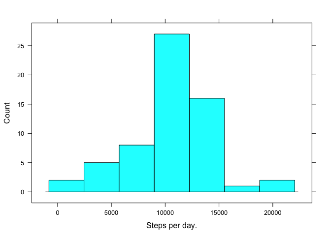

# Reproducible Research: Peer Assessment 1


## Loading and preprocessing the data..

```r
## activity.csv must be unzipped in your working directory
data <- read.table("activity.csv", sep = ",", header = TRUE)
data$date <- as.POSIXct(data$date, format = "%Y-%m-%d" )
```

## What is mean total number of steps taken per day??

```r
library(lattice)
dailysum <- aggregate(data$steps, list(data$date), sum, na.rm = T)
histogram(~x, data = dailysum, type = "count", xlab = "Steps per day")
```

 

```r
dailysummean <- mean(dailysum$x)
dailysummedian <- median(dailysum$x)
print(paste("The mean daily steps is ", dailysummean, " and the median daily steps is ", dailysummedian))
```

```
## [1] "The mean daily steps is  9354.22950819672  and the median daily steps is  10395"
```


## What is the average daily activity pattern?

```r
fiveminaverage <- aggregate(data$steps, list(data$interval), mean, na.rm= T)

xyplot(x~Group.1, data = fiveminaverage, type = "l", ylab = "Average number of steps taken", xlab = "5-minute interval")
```

 

```r
maxinterval <- fiveminaverage[which.max(fiveminaverage$x),1]
print(paste("The 5-minute interval that contains the maximum number of steps is ",maxinterval))
```

```
## [1] "The 5-minute interval that contains the maximum number of steps is  835"
```

## Imputing missing values

```r
## the following code replaces any NA data with its corresponding 5-minute interval average 
replacedata <- data
fiveminaverage <- aggregate(data$steps, list(data$interval), mean, na.rm= T)
replacedata$fiveminaverage <- fiveminaverage$x
the.nas <- is.na(replacedata$steps)
replacedata$steps[the.nas] <- replacedata$fiveminaverage[the.nas]
replacedata$fiveminaverage <- NULL


dailysumreplaced <- aggregate(replacedata$steps, list(replacedata$date), sum)

dailysumreplacedmean <- mean(dailysumreplaced$x, na.rm = T)
dailysumreplacedmedian <- median(dailysumreplaced$x, na.rm = T)

histogram(~x, data = dailysumreplaced, type = "count", xlab = "Steps per day")
```

 

```r
print(paste("The new mean daily steps is ", dailysumreplacedmean , " and the median daily steps is ", dailysumreplacedmedian) ) 
```

```
## [1] "The new mean daily steps is  10766.1886792453  and the median daily steps is  10766.1886792453"
```

## Are there differences in activity patterns between weekdays and weekends?


```r
weekdayanalysis <- replacedata

weekdayanalysis$datefactor <- as.factor(weekdays(weekdayanalysis$date))
levels(weekdayanalysis$datefactor) <- c("Weekday","Weekday","Weekend","Weekend","Weekday","Weekday","Weekday")

weekdayanalysissum <- aggregate(weekdayanalysis$steps, list(weekdayanalysis$interval,weekdayanalysis$datefactor), mean)

xyplot(x~Group.1 | Group.2, data = weekdayanalysissum, type = "l", layout = c(1,2), xlab = "5-minute interval", ylab = "average steps per day")
```

 
